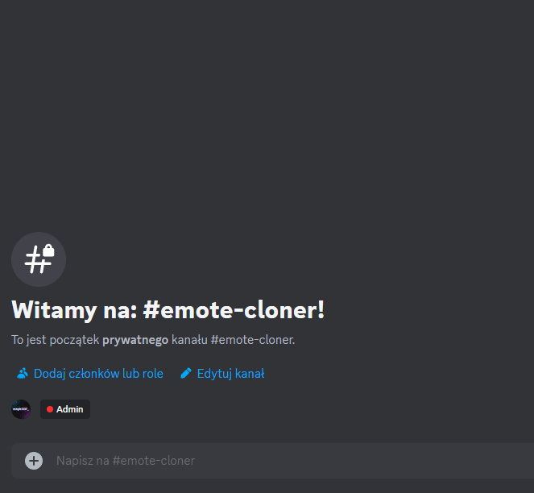

# Emote Cloner
**Emote Cloner** is a Discord bot that clones emotes from BetterTTV and 7TV into Discord.

Emote Cloner is **not affiliated** with Twitch, BetterTTV, FrankerFaceZ or 7TV.

## 🔗 Links
- [🤖 Invite Link](https://discord.com/api/oauth2/authorize?client_id=1163079809719611413&permissions=8799314249792&scope=bot)

## ✨ Features
- Cloning any emote from [BetterTTV](https://betterttv.com).
- Cloning any emote from [7TV](https://7tv.app).

## ⚙️ Commands
- 🔧 **/emote** - Clones any emote from BTTV/7TV.
  - 🔒 This command requires **Manage Expressions** permission.
  - ⚙️ Parameters:
    - 🔗 **url** (Required) - Emote URL (Supported platforms: BTTV, 7TV)
    - 🔼 **size** - Emote size - 1x, 2x, 4x (3x for BTTV)
    - 📝 **name** - Override default emote name
    - 🛑 **disable_animations** - If animated, emote will be uploaded as static image



## 🚀 Run it for yourself
- Clone this repository. 
- Run `npm install` to install required dependencies.
- Create an application on [Discord Developer Portal](https://discord.com/developers/applications).
- Create file named `.env`, and add this information to it:
```dotenv
CLIENT_ID= # Your app's client ID
TOKEN= # Your app's bot token
```
- Run `npm run build` to build the bot.
- After building, run `npm run start` to start the bot.