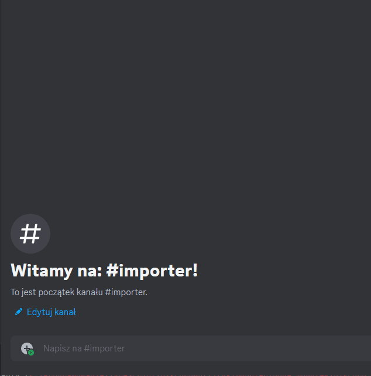

# 7TV Importer
**7TV Importer (Unofficial)** is a Discord bot that can import emotes from 7TV into Discord.

7TV Importer is **not affiliated** with 7TV.

[Add 7TV Importer to your server](https://discord.com/api/oauth2/authorize?client_id=1163079809719611413&permissions=8799314249792&scope=bot)

## Usage
To add an emote, use the **/emote** command.

Command options:
- url (Required) - Emote URL
- size - Emote size (1x, 2x or 4x)
- name - Overwrite emote name
- disable_animations - If the emote is animated, it will be uploaded as non-animated image